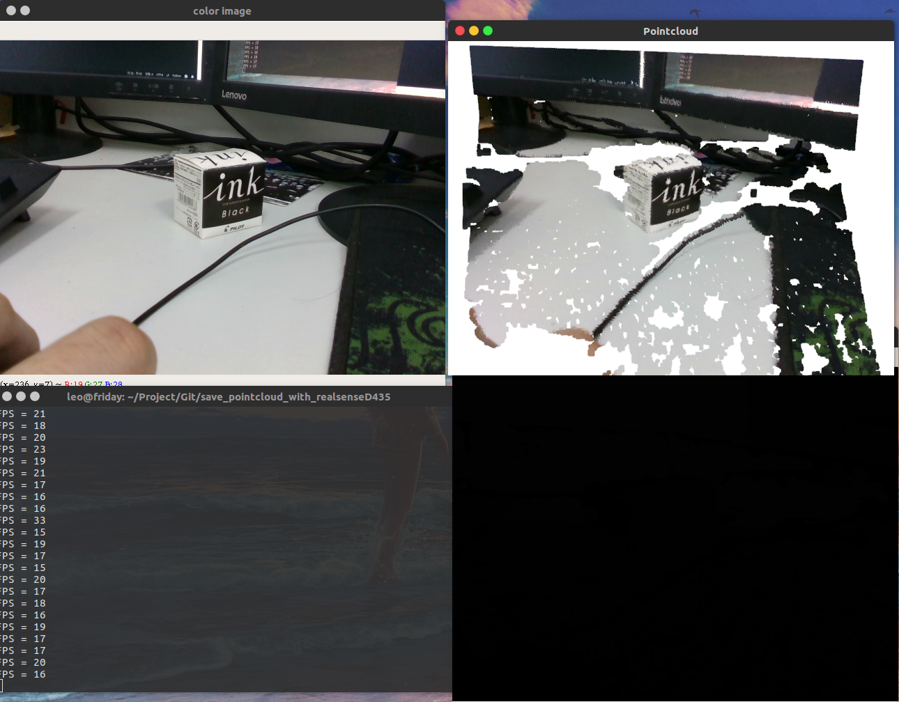
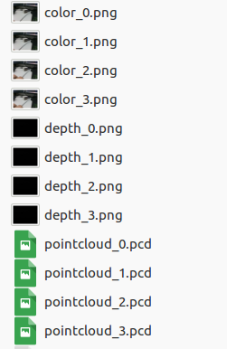

# Basic usage with RealSenseD435
This script is written accoding to the code mentioned in the issue [Convert Realsense poincloud in Open3D pointcloud](https://github.com/IntelVCL/Open3D/issues/473)

## Requirements
* [NumPy](https://pypi.org/project/numpy/)
* [OpenCV](https://pypi.org/project/opencv-python/)
* [PyRealsense2](https://pypi.org/project/pyrealsense2/)
* [Open3D](https://github.com/IntelVCL/Open3D)


## Usage:
**Capture RGB-D images and colored pointcloud**
```
python captureRGBDpt.py
```
Press **‘s’** on the image(depth or color) window，the current rgb-d images and pointcloud will be saved.

Press **'q'** ,the pipeline will be stopped.

**To record a '.bag' file**
```
python readBag.py
```
Press **‘s’** on the image(depth or color) window，the current rgb-d images and colored pointcloud will be saved.

Press **'q'** ,the pipeline will be stopped.And the rgb-d stream will be stored in a'.bag' file named timestamp like '2019-08-20_10:31:07.bag'.

**To read a '.bag' file**
```
python -i your.bag
```
Press **‘s’** on the image(depth or color) window，the current rgb-d images and pointcloud will be saved.

Press **'q'** ,the pipeline will be stopped.

## Screenshot



 
